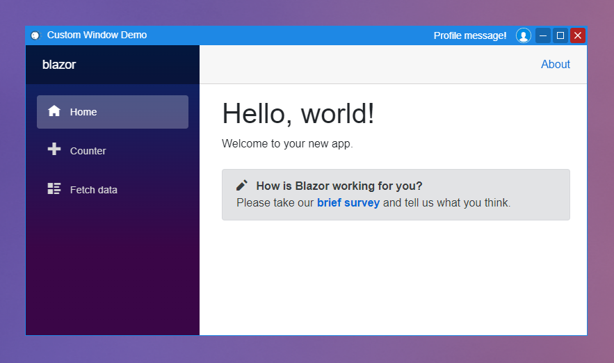

#  Photino.Blazor.CustomWindow

## About
Customizable cross-platform window view and behaviour implementation for Photino.Blazor applications with Chromeless mode.\
The project provides Blazor component named `CustomWindow` that takes up the entire space of the cromeless window and renders custom window header and borders.
It includes the possibility of customizing the window header up to the icon, title and control buttons, moving the window on header dragging, window resizing on borders dragging, and some other features such as stretching (expanding) the window by half the screen when moving it to the boundaries of the monitor's work area.
Default control buttons allow to minimize, maximize and close the window. At the same time, the component also provides appropriate methods.

## How to use
1. Include **Photino.Blazor.CustomWindow** as PackageReference to your project.
2. Include css and js files from _content/Photino.Blazor.CustomWindow to your index.html as shown in the [example](Photino.Blazor.CustomWindow.Sample/wwwroot/index.html). Or you can add their contents manually as your own files.
3. Add CustomWindow to your Photino.Blazor application service collection with `AddCustomWindow()` extension.
4. Use `CustomWindow` component as root in your markup and place your content to its `WindowContent` RenderFragment (see [example](Photino.Blazor.CustomWindow.Sample/Shared/MainLayout.razor)).
5. Don't forget to set the `PhotinoWindow.Chromeless` property to true.

## Problems
- When Blazor catch an unhandled error, entire window freezes including any interaction with CustomWindow. This can only be solved by creating a solution based on JavaScript and not Blazor.
